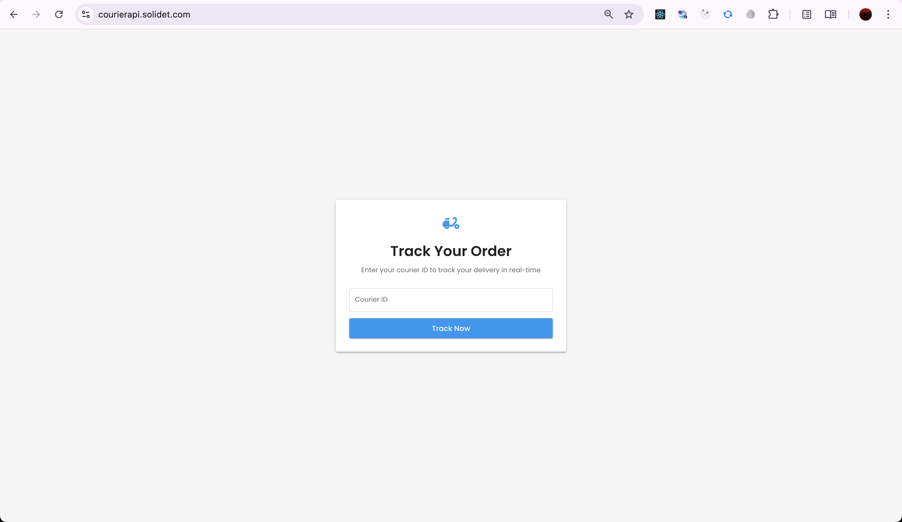
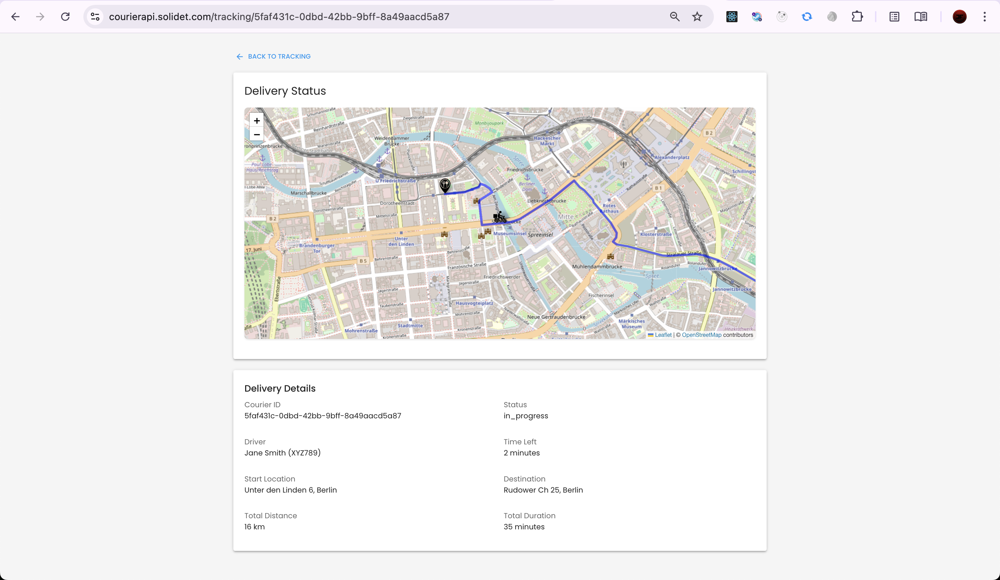

# Courier Simulation API 🚚

A powerful API for simulating courier delivery operations with real-time tracking and route simulation. Perfect for testing delivery applications, this API provides realistic courier movements along actual city routes using OpenRoute Service for accurate street-level navigation.

## 🌟 Key Features

- Real-time courier position simulation based on elapsed time
- Time-based movement along actual street routes
- Street-level navigation and addressing
- Automatic courier assignment
- Configurable simulation speed (20x faster)
- Real-world route generation
- Persistent courier state tracking

## 🚀 Getting Started

### Prerequisites

- Node.js installed
- OpenRoute Service API key

### Setup

1. Install dependencies:
   ```bash
   npm install
   ```

2. Create a `.env` file in the root directory and add your OpenRoute Service API key:
   ```
   OPENROUTE_API_KEY=your_api_key_here
   ```

### Running the Server

Development mode with auto-reload:
```bash
npm run dev
```

Production mode:
```bash
npm start
```

## 📚 API Documentation

### 1. Get Courier Information
```http
GET /couriers/:courierId
```

#### Response
```typescript
{
  id: string;
  name: string;
  licensePlate: string;
  status: 'in_progress' | 'completed';
  position: {
    lat: number;
    lng: number;
    progress: number;        // 0-100
    currentStep: number;     // current waypoint number
    totalSteps: number;      // total waypoints in route
    address: string | null;  // current street/location name
    timeLeft: string;        // e.g., "5 minutes" or "30 seconds"
  };
  routeInfo: {
    startAddress: string;
    endAddress: string;
    totalDistance: string;   // e.g., "13 km"
    totalDuration: string;   // e.g., "29 minutes"
  };
}
```

### 2. Create New Order
```http
POST /order
```

#### Request Body
```typescript
{
  from: string;  // pickup address
  to: string;    // delivery address
}
```

#### Response
```typescript
{
  id: string;
  name: string;
  licensePlate: string;
  status: 'created';
  routeInfo: {
    startAddress: string;
    endAddress: string;
    totalDistance: string;   // e.g., "13 km"
    totalDuration: string;   // e.g., "29 minutes"
  };
}
```

## 💡 Example Usage

### Creating a New Delivery Order
```bash
curl -X POST http://localhost:3000/order \
  -H "Content-Type: application/json" \
  -d '{
    "from": "Schönleinstraße 4, Berlin",
    "to": "Rudower Chausee 25, Berlin"
  }'
```

### Tracking Courier Position
```bash
curl http://localhost:3000/couriers/COURIER_ID
```

Example Response:
```json
{
  "id": "539f1c26-efc9-4f11-a8b8-4f26f1c7b2f1",
  "name": "Mike Johnson",
  "licensePlate": "DEF456",
  "status": "in_progress",
  "position": {
    "lat": 52.46674429979578,
    "lng": 13.44610386439755,
    "progress": 52,
    "currentStep": 172,
    "totalSteps": 333,
    "address": "Naumburger Straße",
    "timeLeft": "14 minutes"
  },
  "routeInfo": {
    "startAddress": "Schönleinstraße 4",
    "endAddress": "Rudower Chausee 25",
    "totalDistance": "13 km",
    "totalDuration": "29 minutes"
  }
}
```

## 🔄 How Simulation Works

The simulation engine provides a realistic delivery experience with the following features:
- Automatic courier assignment and immediate movement upon order creation
- Position calculation based on elapsed time since order creation
- Accelerated simulation (20x faster than real-time) for testing
- Real-time position updates on request
- Fixed position once destination is reached
- Time-based position calculation rather than step-by-step movement

## 🖥️ Client Application

The project includes a modern web client for easy interaction with the courier simulation API.

### Tracking Form
A clean, user-friendly interface for:
- Submitting tracking IDs
- Viewing delivery status and progress



### Tracking Details View
A comprehensive tracking dashboard showing:
- Real-time courier position on an interactive map
- Detailed delivery progress information
- Current street location and time estimates
- Complete route overview with distance and duration



## 📝 Technical Notes

- Simulation runs at 20x real-time speed for testing efficiency
- Position calculations are based on order creation timestamp
- Address data is powered by OpenRoute Service
- Time estimates account for simulation speed multiplier 